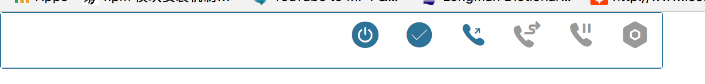
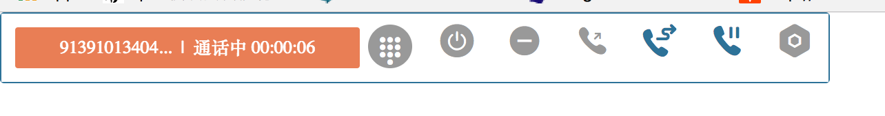
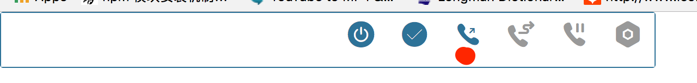
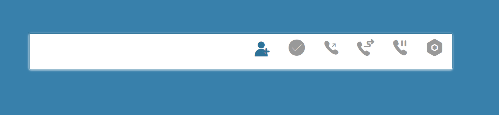
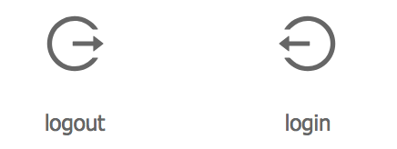
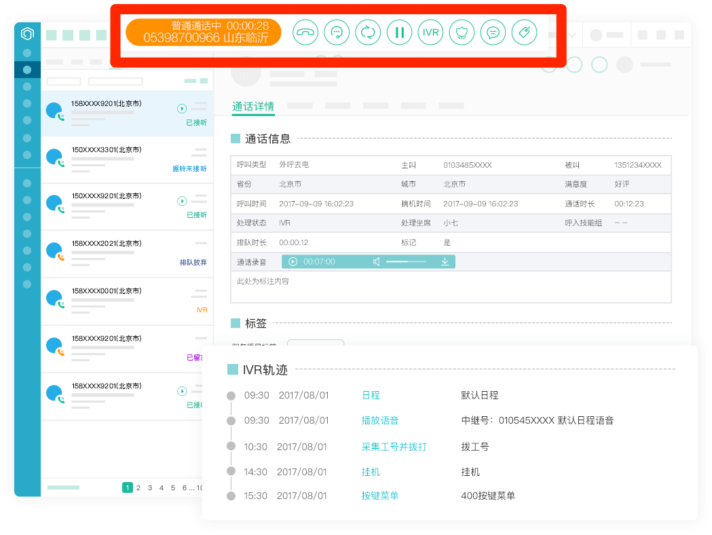

#### css问题

一个工具条，六七个按钮 css样式规则不应该1200多行！用css digg查一样是很多重复冲突

做在线客服时候样式重复问题我就很有意见，但当时没有经验、能力来解决。这次不同，一定要解决，没有任何借口！

举例目前问题：

`class="zhuce" id="zhuce"`  class 和 id 这样设置完全是错误，class如果只有一个元素，那和id有什么两样；搜索 zhuce 一共有5条规则

这个id设置没有意义，真正选择元素的时候用的  "#EphoneBar li[data-phone-type='register']" 也没用id

代码上把 ._Sel 和直接用document.querySelector 合并、改进下，在html.js提供选择这几个按钮的方法

##### UI上改进

1. 太宽,为通话状态留出的空间太大
2. 按钮没居中,对比通话中状态条就能明显看出 
3. 通话中拨号盘不要显示目前位置，占地方。我希望显示在拨号按钮下方 ， 同时通话中图标要改成挂机按钮。
4. 登入登出显示不明确  我希望是这样 
5. 置忙闲的显示 改进，至少是颜色上用绿色和红色。

注 ： 我们主要参照是 容联七陌 

#### 讨论后修改意见

1. 登出不要单独占用一个位置，尤其是在没登入时候显示单独按钮太浪费空间；动态生成一个按钮目前看引入工作量大，不考虑；放在**设置**按钮也有不妥，所以还是决定和登入按钮一起。
2. 置闲置忙按钮单独占用一个按钮位置也同样浪费，而且qq，skype忙闲状态都是在人像旁边一个小圆点。
3. 综合上述两点，登入按钮选择小人图标，忙闲和qq一样在人像旁边一个圆点显示；登入后点击按钮直接切换忙闲状态。 登出按钮在登录按钮旁边一个小的向下箭头图标，在用户登陆后才显示这个小图标。点开后显示退出菜单，点击退出。登入按钮要比其他几个按钮稍微宽一点，防止点切换状态时候误点到退出按钮
4. 通话按钮在接通后要改显示挂机的按钮；通话按钮在接通后旁边同样显示下图，点击弹出拨号盘。但因为我们目前还没DTMF功能，所以这次可以暂时不显示小图标.
5. 通话状态单独一个div，所有button一个div，最外面再一个包裹他们的div。button的div和状态的div通话设置 `float: left` 或者`float: right`在决定谁在左谁在→，同时在设置里可配

#### 代码逻辑要改的地方

**phonejs**

1. `this.register(undefined)` 到底什么意思？
2. `this._ua.login(loginParam);` 加回调方法 
3. `this._ua.on('newMessage'` 两次，应该会把正确的 receiveNewMsg 去掉？！
4. `terminate` lib封装好
5. this._ua.sendMessage(callId + "_00013093", content, msgOptions);   Phone.js的sendMessage到底有没有用

**index.js**

var that = this 的使用，很担心，回调时候才会变需要这样，或者是箭头函数

eventListener 里的this 对不对？

register 不是回调，不需要

**提交代码里** 不想再看到console.log

